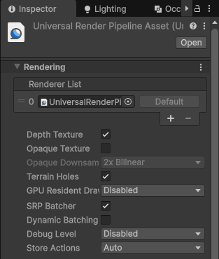




## Ray–AABB 相交函数

### 函数代码

```hlsl
float2 RayBoxDst(float3 boxMin, float3 boxMax, float3 pos, float3 rayDir)
{
    float3 t0 = (boxMin - pos) / rayDir;
    float3 t1 = (boxMax - pos) / rayDir;

    float3 tmin = min(t0, t1);
    float3 tmax = max(t0, t1);

    float dstA = max(max(tmin.x, tmin.y), tmin.z);
    float dstB = min(min(tmax.x, tmax.y), tmax.z);

    float dstToBox = max(0, dstA);
    float dstInBox = max(0, dstB - dstToBox);

    return float2(dstToBox, dstInBox);
}
```

------

### 公式推导

1. **射线方程**
$$
  P(t) = pos + t \cdot rayDir, \quad t \geq 0
$$
  AABB（轴对齐包围盒）：
$$
  boxMin \leq P(t) \leq boxMax
$$

2. **每个轴的交点参数**

   ```hlsl
   t0 = (boxMin - pos) / rayDir;
   t1 = (boxMax - pos) / rayDir;
   ```

3. **区分进入与离开**

   ```hlsl
   tmin = min(t0, t1); // 进入
   tmax = max(t0, t1); // 离开
   ```

4. **整体进入 / 离开时刻**

   ```hlsl
   dstA = max(tmin.x, tmin.y, tmin.z); // 最近进入
   dstB = min(tmax.x, tmax.y, tmax.z); // 最远离开
   ```

------

### 判定逻辑

- `dstB < dstA` → 射线不能穿过盒子 → 无交点
- `dstB < 0` → 整个盒子都在射线起点后面 → 无交点

------

### 返回值

- `dstToBox`：射线起点到进入盒子的最近距离
  - 如果起点在盒子外：正常返回
  - 如果起点在盒子内：会是负数， `max(0, dstA)` 返回0
- `dstInBox`：射线在盒子内部能走的距离



[A Minimal Ray-Tracer](https://www.scratchapixel.com/lessons/3d-basic-rendering/minimal-ray-tracer-rendering-simple-shapes/ray-sphere-intersection.html?utm_source=chatgpt.com)


[Fewes/CloudNoiseGen: A static utility class for Unity which handles generating and loading periodic, cloud-like (perlin-worley) 3D noise textures on the GPU.](https://github.com/Fewes/CloudNoiseGen/tree/master)

[【GPU Pro 7】Real-Time Volumetric Cloudscapes - 简书](https://www.jianshu.com/p/ae1d13bb0d86)

[(25 封私信 / 80 条消息) Unity URP RayMarching 体积云 - 知乎](https://zhuanlan.zhihu.com/p/440607144)
